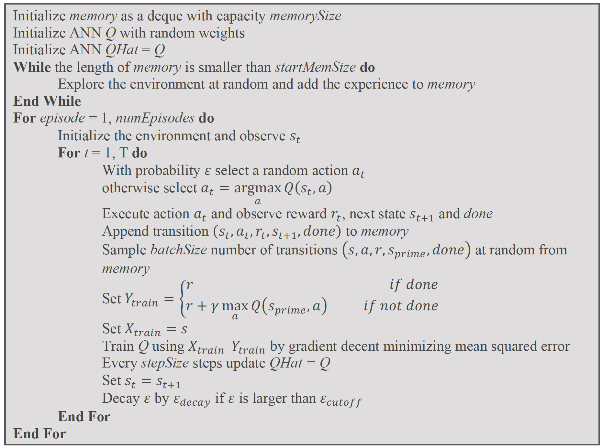
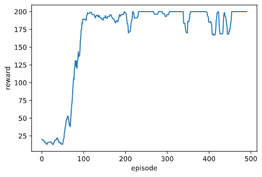
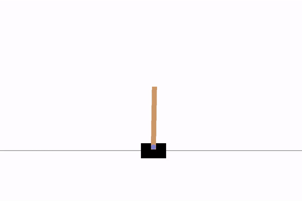
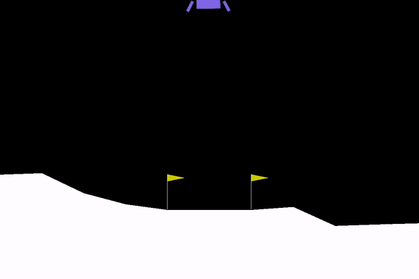
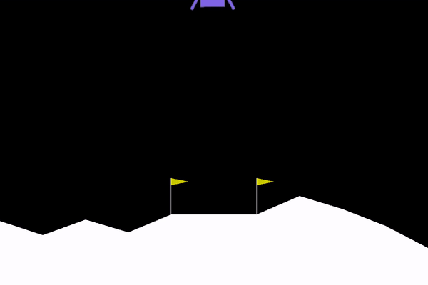
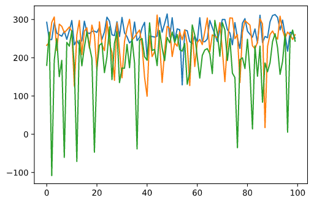
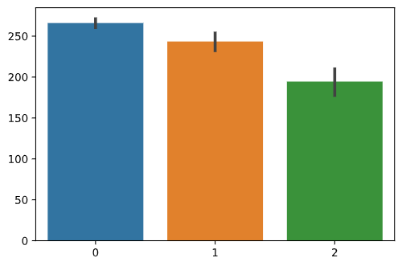

# Tackling OpenAI gym using Deep Q-network: *CartPole-v0* and *LunarLander-v2*

### Introduction to Deep Q-network
In reinforcement learning, using function approximation to state-value functions (Q functions) allows the agent to generalize among similar state-action pairs and apply learned experience to new but similar situations, a strategy natural to human and other animals. It makes learning in a huge state-action space possible. Artificial neural network (ANN) is a powerful tool for function approximation because any function can be approximated to arbitrary accuracy by an ANN with three or more layers of units [2]. However, using ANN, a nonlinear model, to approximate a Q function can lead to instability or divergence due to “the deadly triad” [3]. This problem can be solved by using a deep Q-network (DQN) [4].

DQN addresses the instability problem with two approaches. Firstly, it uses “experience replay” to store past state-action transitions in memory and sample them at random for training the model. This way, it removes correlations in the observation sequence and smooths over changes in the data distribution. Secondly, it employs an additional Q function for calculating target values that are only periodically updated, thereby reducing correlations with the target and improves stability [4]. 
To solve the lunar lander problem using function approximation with ANN, I adopted the DQN method. Additionally, instead of taking state, action as input and outputting the corresponding Q value, my ANN took state variables as an input and output action values for all actions, an approach that was also used in the DQN paper. This allows one to compute Q values for all possible actions in a given state with only a single forward pass through the network [4]. The model is updated based on the bellman equation [3]: Q[s(t),a]=r+γ * maxQ[s(t+1),a] where Q[s(terminal),a]=0 for all a.

### DQN implementation
The full algorithm is shown below, the ANN is constructed using the tensorflow.keras library. The python code can be found in `DQN.py.`

### *CartPole-v0*
Parameters for ANN and learning can be found in `cartpole.ipynb`. We used a ANN with 2 hidden layers, with 16 and 8 nodes each.
The performance of the DQN gradually increased during training as shown below.

The trained DQN was able to balance cartpole indefinitely. 

### *LunarLander-v2*
Parameters for ANN and learning can be found in `lunarlander.ipynb`. We used a ANN with 3 hidden layers due to a significantly larger state-action space compared to cartpole, with 128, 64 and 32 nodes each.
The performance of the DQN gradually increased during training as shown below.

The trained DQN was able to solve the lunarlander problem. Below is a comparsion before and after training.
##### Before

##### After

Next I tried to simply the ANN used in lunarlander. I first tried to remove a layer from my ANN, the simplified ANN performed slightly worse but was still able to solve the problem. Next I tried to reduce the number of nodes in each layer. I was able to reduce the number of nodes to 32 and 16. The resulting ANN performed significantly poorer and was barely able to solve the problem, further simplification of the ANN was not successful. The result of 100 runs for each of the three trained ANNs are shown below. It is very clear that the representation power of the ANN is positively associated with the performance of the trained model.

Neuronet|Structure|# parameters|Legend Color
------|---------|------------|-------------
ANN#1|256, 128, 128|52228|Blue
ANN#2|256, 128|35716|Orange
ANN#3|32, 16|884|Green

### References
1. https://gym.openai.com/
2. Thomas M. Mitchell. 1997. Machine Learning (1st. ed.). McGraw-Hill, Inc., USA.
3. Richard S. Sutton and Andrew G. Barto. 2018. Reinforcement Learning: An Introduction. A Bradford Book, Cambridge, MA, USA.
4. Mnih, V., Kavukcuoglu, K., Silver, D. et al. Human-level control through deep reinforcement learning. Nature 518, 529–533 (2015). https://doi.org/10.1038/nature14236
